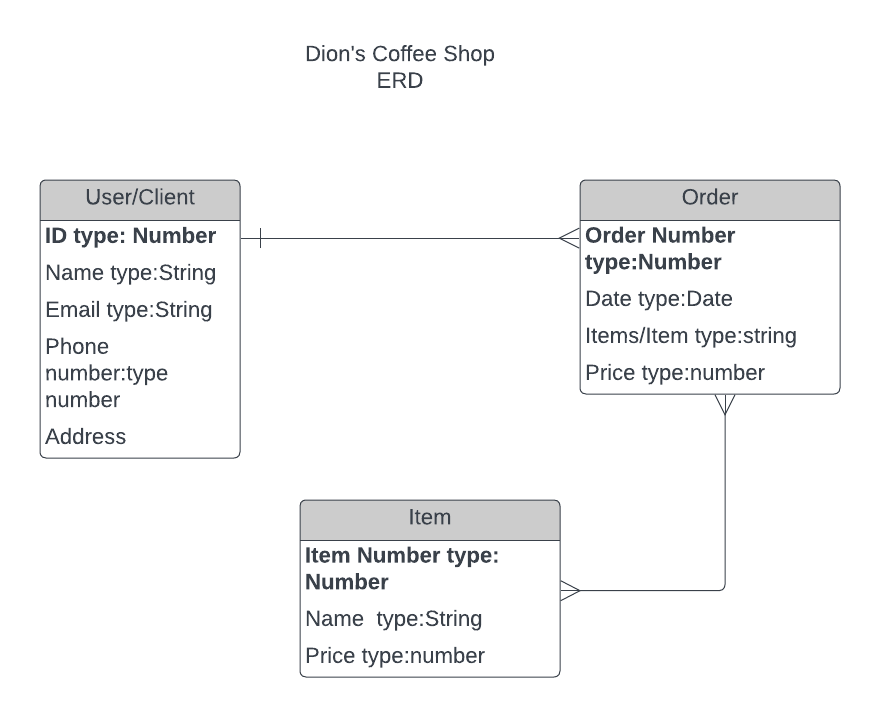
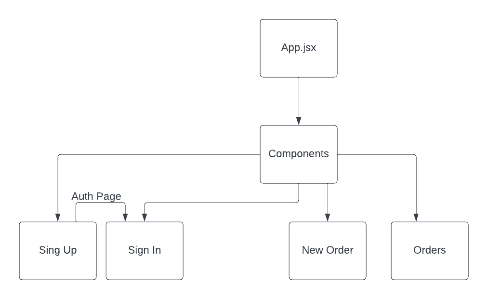

# CapstoneProject 

# E-commerce Coffee Shop
## Date: 07/06/2023

### By: Platin Syla 

####  | [GitHub](https://github.com/platinyy/CapstoneProject) |

---

### **_Description_**
This e-commerce application is made using (MERN) Express Node MongoDB and React.The main purpose of this application is to allow users/clients to buy food and drinks from a small family business called Dion's Coffe Shop.Clients can select items that they want to buy , make the order, and pay for it, all through this application online site, and than they can either pick up the order or have it deliver to them.

---
### **_Technologies Used_**

- Express
- Node
- MongoDb
- React
- CSS
- JavaScript

---

### **_Dion's Coffee ERD Diagram_**

### **_Component Hierarchy Diagram_**

### **Trello Board**
####  | [Trello Board](https://trello.com/invite/b/buVIf6Gy/ATTIf9b51c77ff04c943e3eec18d9e945bb3610EFE12/capstone-project) |